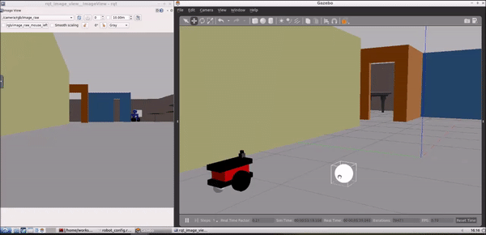

# Ball-Chaser-Robot
A simple robot modelled using URDF and programmed using ROS to move towards any white object that is placed in front of it.

The ROS project consists of 2 packages, **my_robot** and **ball_chaser**. The *my_robot* package contains the robot and world models which can be visualised in the Gazebo simulator when the package is run using the *roslaunch* command. The *ball_chaser* package is responsible for detecting and moving towards any white object in front of the robot by reading the feed from the camera attached to the front of the robot.

## Nodes
* drive_bot - Node that provides a service to command the robot wheel joints
* process_image - Node that subscribes to the camera feed topic and calls the service to move the robot when a white ball or object is detected

## Publishers, Subscribers and Services
* Publishing and Subscribing Topics
  * /cmd_vel - Topic to publish velocity values to move or turn the robot
  * /camera/rgb/image_raw - Topic that the camera images are published to and can be subscribed to read from
* Services
  * /ball_chaser/command_robot - Service provided by the *drive_bot* node to move the robot when requested
  
## ROS and Ubuntu version used
ROS Kinetic in Ubuntu 16.04
